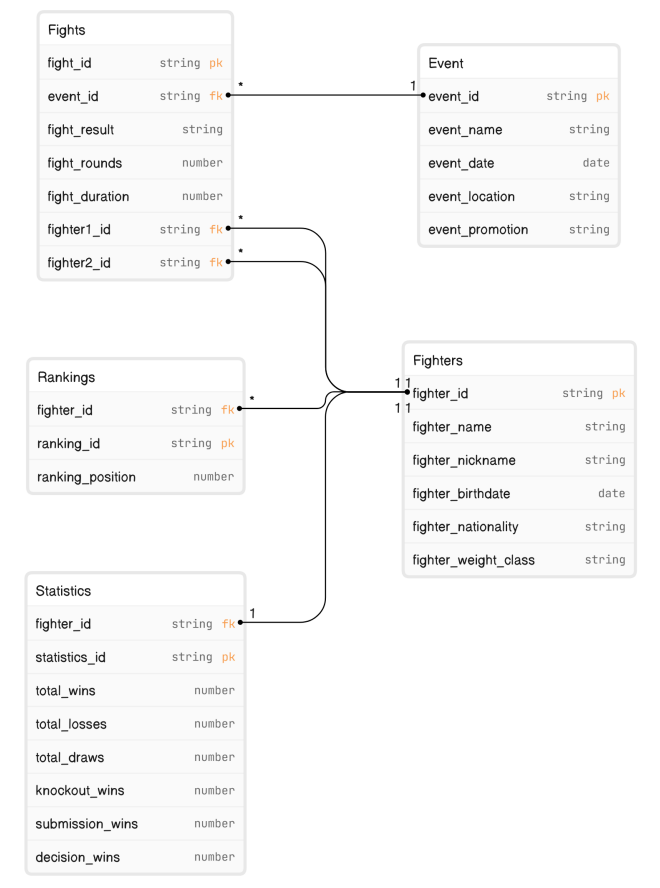

<p align="center">
  <a href="http://nestjs.com/" target="blank"></a>
</p>

[circleci-image]: https://img.shields.io/circleci/build/github/nestjs/nest/master?token=abc123def456
[circleci-url]: https://circleci.com/gh/nestjs/nest

  <p align="center">A progressive <a href="http://nodejs.org" target="_blank">Node.js</a> framework for building efficient and scalable server-side applications.</p>
    <p align="center">
<a href="https://www.npmjs.com/~nestjscore" target="_blank"></a>
<a href="https://www.npmjs.com/~nestjscore" target="_blank"></a>
<a href="https://www.npmjs.com/~nestjscore" target="_blank"></a>
<a href="https://circleci.com/gh/nestjs/nest" target="_blank"></a>
<a href="https://coveralls.io/github/nestjs/nest?branch=master" target="_blank"></a>
<a href="https://discord.gg/G7Qnnhy" target="_blank"></a>
<a href="https://opencollective.com/nest#backer" target="_blank"></a>
<a href="https://opencollective.com/nest#sponsor" target="_blank"></a>
  <a href="https://paypal.me/kamilmysliwiec" target="_blank"></a>
    <a href="https://opencollective.com/nest#sponsor"  target="_blank"></a>
  <a href="https://twitter.com/nestframework" target="_blank"></a>
</p>
  <!--[](https://opencollective.com/nest#backer)
  [](https://opencollective.com/nest#sponsor)-->

## Description

[Nest](https://github.com/nestjs/nest) framework TypeScript starter repository.

## Installation

1. Clone the repository
2. Execute:

```bash
$ npm install
```

3. Set up the database with docker

```bash
$ docker-compose up -d
```

4. You can add autoload entities in order to create the database automatically (not recomended for production), instead you can run the following typeOrm commands to create the migration (Just in case that you dont have the migration folder and file inside the db folder you can skip this step), every time that you make a change in the entities a new migration should be generated:

```bash
$ npm run migration:generate db/migrations/testMigration
```

This will generate inside the `db/migration` folder a typescript file with all the querys to create the tables

5. To load this testMigration with the CLI you can use

```bash
$ npm run migration:run
```

In case that you already have a migration file and want to purge your db, you can use:

```bash
$ npm run migration:revert
```

6. Running the app

```bash
# development
$ npm run start
```

## ERD DIAGRAM:

This is the entity relation diagram used in this project



The sql obtained through the migration is:

```SQL

CREATE TABLE "ranking" ("ranking_id" uuid NOT NULL DEFAULT uuid_generate_v4(), "ranking_position" integer NOT NULL, "fighter_id" uuid NOT NULL, CONSTRAINT "PK_deb95c934f7d9d99536ec7a857a" PRIMARY KEY ("ranking_id"));

CREATE TABLE "statistics" ("statistics_id" uuid NOT NULL DEFAULT uuid_generate_v4(), "fighter_id" uuid NOT NULL, "total_wins" integer NOT NULL, "total_losses" integer NOT NULL, "total_draws" integer NOT NULL, "knockout_wins" integer NOT NULL, "submission_wins" integer NOT NULL, "decision_wins" integer NOT NULL, CONSTRAINT "PK_64580b4ea4d36aee041af89ac53" PRIMARY KEY ("statistics_id"));

CREATE TABLE "fighter" ("fighter_id" uuid NOT NULL DEFAULT uuid_generate_v4(), "fighter_name" character varying NOT NULL, "fighter_nickname" text NOT NULL, "fighter_birthdate" TIMESTAMP NOT NULL, "fighter_nationality" character varying NOT NULL, "fighter_weight_class" character varying NOT NULL, CONSTRAINT "UQ_81b64c614c593512c0b64bc1068" UNIQUE ("fighter_nickname"), CONSTRAINT "PK_76c8d6359ab02454ea737914b52" PRIMARY KEY ("fighter_id"));

CREATE TABLE "fights" ("fight_id" uuid NOT NULL DEFAULT uuid_generate_v4(), "fight_result" integer NOT NULL, "fight_rounds" integer NOT NULL, "fight_duration" integer NOT NULL, "eventIdEventId" uuid, "fighter1IdFighterId" uuid, "fighter2IdFighterId" uuid, CONSTRAINT "PK_61dc76f2c217d0e20394da69392" PRIMARY KEY ("fight_id"));

CREATE TABLE "event" ("event_id" uuid NOT NULL DEFAULT uuid_generate_v4(), "event_name" character varying NOT NULL, "event_date" TIMESTAMP NOT NULL, "event_location" character varying NOT NULL, "event_promotion" character varying NOT NULL, CONSTRAINT "PK_fe0840e4557d98ed53b0ae51466" PRIMARY KEY ("event_id"));

ALTER TABLE "fights" ADD CONSTRAINT "FK_fc1bd2697c341d0cd5c990e31b9" FOREIGN KEY ("eventIdEventId") REFERENCES "event"("event_id") ON DELETE NO ACTION ON UPDATE NO ACTION;

ALTER TABLE "fights" ADD CONSTRAINT "FK_593c3973f039f52e201e9c31e0d" FOREIGN KEY ("fighter1IdFighterId") REFERENCES "fighter"("fighter_id") ON DELETE NO ACTION ON UPDATE NO ACTION;

ALTER TABLE "fights" ADD CONSTRAINT "FK_e300b17a040a0427d65e415d05f" FOREIGN KEY ("fighter2IdFighterId") REFERENCES "fighter"("fighter_id") ON DELETE NO ACTION ON UPDATE NO ACTION;


```

The sql to drop the table through the migration is:

```SQL
ALTER TABLE "fights" DROP CONSTRAINT "FK_e300b17a040a0427d65e415d05f";
ALTER TABLE "fights" DROP CONSTRAINT "FK_593c3973f039f52e201e9c31e0d";
ALTER TABLE "fights" DROP CONSTRAINT "FK_fc1bd2697c341d0cd5c990e31b9";
DROP TABLE "event";
DROP TABLE "fights";
DROP TABLE "fighter";
DROP TABLE "statistics";
DROP TABLE "ranking";
```
